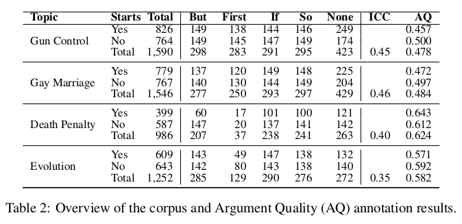

# Argument Mining: Extracting Arguments from Online Dialogue
 Reid Swanson & Brian Ecker & Marilyn Walker
 
 ## Abstract
 aim: use dialogue corpora to automatically discover the semantic aspects of arguments
 that conversants are making across multiple dialogues on a topic
 
 two tasks:
 * argument extraction (this paper)
 * argument facet similarity
 
 goal:
 * train regressors to predict the quality of extracted arguments with RRSE values
 * develop regressors that are topic independent.
 
 ## Introduction
 * __argument Extraction__ : how can we extract argument segments in dialogue
 that clearly express a particular argument facet?
 * __Argument Facet Similarity__: how can we recgonize that two argument segments are
 semantically similar, about the same facet of the argument?
 
 * example: how the sentences in bold are good targets for argument extraction
 
* __IMPLICIT MARKUP__ hypothesis:

    * the arguments that are good candidates for extraction will be marked by cues (implicit markups) provided by the dialog conversants
themselves, i.e. their choices about the surface realization of their arguments.
    * examine a number of theoretically motivated cues for extraction (expected to be domain-independent)
    
### Gliederung
* sec 2. describe our corpus of arguments, and describes the hypothesized markers of high-quality argument segments.
    * sample from the corpus using these markers, and then annotate the extracted argument segments for ARGUMENT QUALITY.
    
* sec 3.2 describes experiments to test whether:
    * we can predict argument quality
    * our hypothesized cues are good indicators of argument quality
    * an argument quality predictor trained on one topic or a set of topics can be used on unseen topics


## Corpus and Method
109074 posts on topics GM, GC and DP

### implicit markup hypothesis
#### Discourse Relation
the Arg1 and Arg2 of explicit SPECIFICATION, CONTRAST, CONCESSION and CONTINGENCY
markers are more likely to contain good argumentative segments.

In the case of `explicit` connectives, Arg2 is the argument to which the connective is syntactically bound, 
and Arg1 is the other argument.

- CONTINGENCY  -- `If`

- CONTRAST -- `But`

- SPECIFICATION -- indicate a focused detailed argument `First` in __R2__

only extract `Arg2`, where the discourse argument is syntactically bound to the connective,
since Arg1's are more difficult to locate, especially in dialogue.

see Table 2.



#### Syntactic Properties
syntactic properties of a clause may indicate good argument segments, such as being the main clause.
or the sentential complement of mental state or speech-act verbs, e.g. the __SBAR__

`P2. you will agree that evolution is useless in getting at possible answers 
on what really matters, how we got here?`
 
test it as a feature in sec .3.2

#### Dialogue Structure
position in the post or the relation to a verbatim quote could influence argument quality.
e.g., being turn-initial in a response

__Starts:YES/NO__

P2,R3, R4.

#### Semantic Density
measures of rich content or SPECIFICITY will indicate good candidates for argument extraction.
* remove sentences less than 4 words long. 
* after collecting the argument quality annotations for these two topics and examining the distribution of scores,
we developed an additional measure of semantic density that weights words in each candidate by its PMI, and applied it to 
`evolution` and `death penalty`
    * using the 26 topic annotations in the IAC , calculate the PMI between every word in the corpus appearing more than 5 times
    and each topic.
    * we only keep those sentences that have at least one word whose PMI is above our threshold of 0.1

### Data Sampling, Annotation and Analysis

arguments:
* completely self-contained
* infer what the argument is based on using world knowledge of the domain, but it is 
not explicitly stated or requires several steps of inference
* there are cases where the user is not making an argument or the argument cannot be reconstructed without significantly more context

collect the annoations for ARGUMENT QUALITY for all the sentences summarized in table 2
on AMT
* IAA: inter-annotator agreement of the binary annotations using krippendorff's alpha
* ICC: interclass correlation coefficients

## Experiments
### Implicit Markup Hypothesis 
using __ANOVA__ testing the effect of a connective and is position in post on argument quality.

```
An ANOVA test is a way to find out if survey or experiment results are significant, in other words, they help to figure out 
if you need to reject the null hypothesis or accept the alternate hypothesis
```

across all sentences in all topics, the presence of a connective is significant

### Argument Quality Regression 
* Linear Least Squared Error (LLS)
* Ordinary Kriging (OK)
* Support Vector Machines (SVM)

75% for train/dev, and 25% for test.

Using train/dev data to develop a set of feature templates. The features are real-valued and normalized 
between 0 and 1, based on min and max values in the training data for each domain.
If not stated otherwise the presence of a feature was represented by 1.0 and its absence by 0.0.

* semantic density features:
    * DEI : deitic pronouns (this, that, it)
    * SLEN: sentence length (number of words)
    * WLEN: include features based on word length   
        * min, max, mean, and median
        * a feature whose value is the count of words of lengths 1 to 20 (or longer)
    * SPTL (speciteller)
    a single aggregate feature from the result of Speciteller, a tool that assesses the specificity of a sentence in the range of 0 
    (least specific) to 1 (most) 
    * KLDiv (Kullback-Leibler Divergence): we expect that sentences on one topic domain will have different content than sentences outside
    the domain 
    * Lexical N-Grams (LNG): create a feature for every unigram and bigram in the sentence.
        The feature value was the idf of that n-gram over all posts in the IAC plus createDebate corpus.

* Discourse and Dialogue features:
expect our features related to the discourse and dialogue 
hypotheses to be domain independent.
